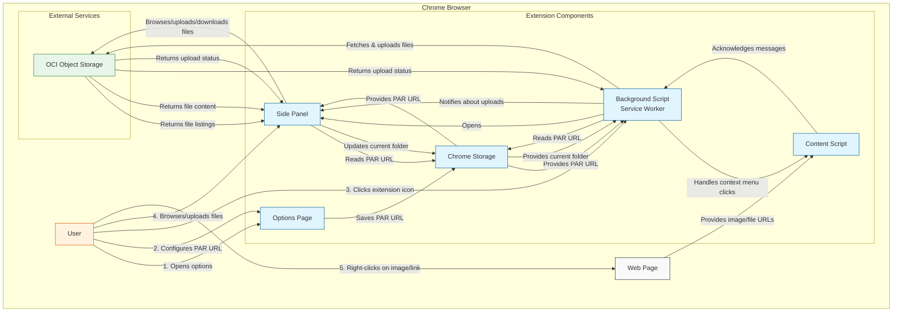
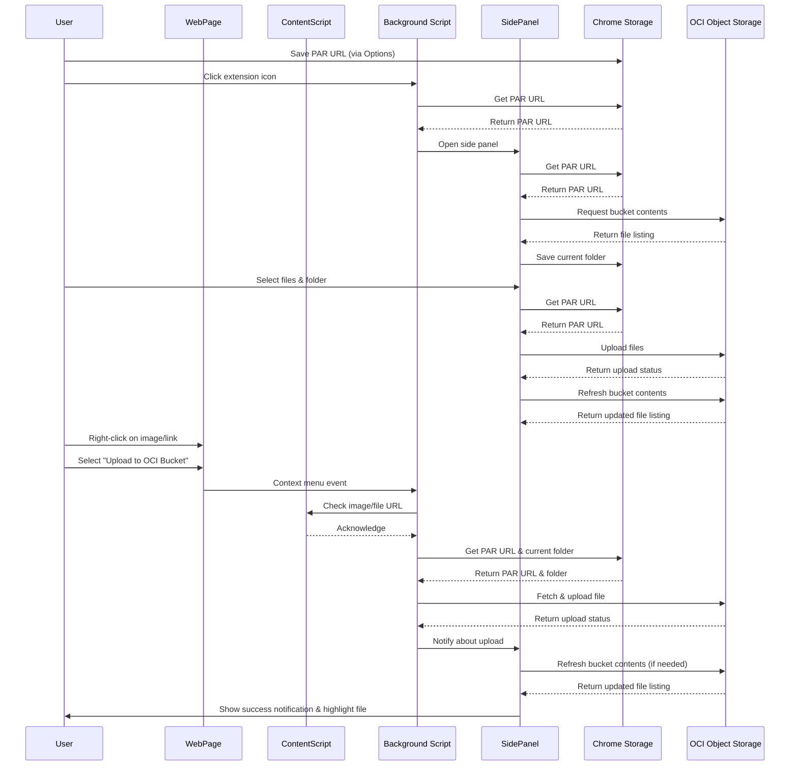

# Quick OCI Object Manager - Architecture Diagram

This document visualizes the architecture and component interactions of the Quick OCI Object Manager Chrome extension.

## Component Interaction Diagram

## Data Flow Diagram

## Component Descriptions

### Background Script (Service Worker)
- Initializes the extension and context menus
- Handles extension icon clicks to open the side panel
- Processes context menu events for image and file link uploads
- Communicates with the content script to get image/file URLs
- Fetches and uploads files to OCI Object Storage
- Notifies the side panel about successful uploads

### Side Panel
- Provides the main user interface for browsing and managing files
- Displays bucket contents with folder navigation
- Handles file uploads from the user's device
- Manages folder creation and selection
- Receives notifications about context menu uploads
- Refreshes and highlights newly uploaded files

### Content Script
- Runs in the context of web pages
- Acknowledges messages from the background script
- Enables context menu functionality for images and file links

### Chrome Storage
- Stores the PAR URL configured in the options page
- Stores the current folder selection for context menu uploads
- Provides persistent storage across browser sessions

### Options Page
- Allows the user to configure the PAR URL
- Saves settings to Chrome Storage

### OCI Object Storage
- External service that stores and serves files
- Accessed via the Pre-Authenticated Request (PAR) URL
- Provides file listing, upload, and download capabilities
